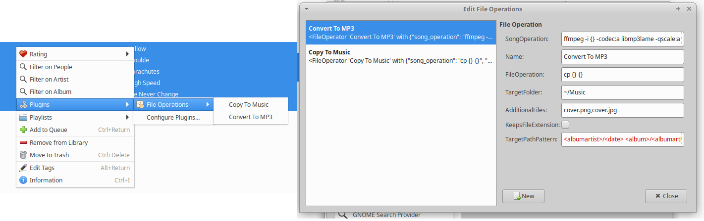

# Quodlibet File Operations Plugin

This Quodlibet-Plugin tries to mimic the [File Operations Feature](https://wiki.hydrogenaud.io/index.php?title=Foobar2000:File_operations) of Foobar2000.
This plugin makes it possible to define Operations on Songs and related files (like covers etc.).

# Motivation

Back in 2013 when I was moving from Linux to Windows, one of my biggest problems was to bind a suitable substitution for Foobar2000. Although worked pretty well with wine, I wanted to find a native Linux solution.

After a while I found QuodLibet, which had almost everything I needed. The only feature missing was the Foobars File Operations. I wanted to be able to define commands which move/copy/transcode songs/albums etc. The "Custom Commands"-Plugin came really close to that, but it didn't work for me, so I wrote my own Quodlibet-Plugin.

# Limitations

  * This plugin has only been tested with Linux (Ubuntu 18.04).
  * Error-Handling is very basic. If an error occures, it might not be reported.
